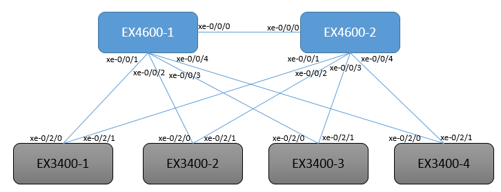

# EX-L2-Config-Builder
An Ansible playbook to automatically generate and/or deploy Juniper EX distribution and access switch configurations. This playbook uses the ELS (Enhanced Layer 2 Software) 
syntax to configure uplink interfaces, management interface, vlans, IRB interfaces, MSTP, Ethernet OAM LFM, and LLDP.

# Diagram

# Running Playbook
1. Update master-vars.yml file with specifics for your network. See in file instructions.
2. Update the access_ports.yml file for each access switch under host_vars/. See in file instructions.
3. Update files under group_vars/all with specifics for your network. See in file instructions.
4. a. Build configs: ansible-playbook build.yml
4. b. Build configs & deploy: ansible-playbook -i inventory build_deploy.yml
5. Generated configs are in the ./Configs directory

